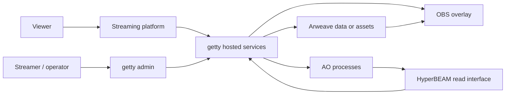

# Architecture

**Status:** Concept · **Audience:** Developers and researchers

Getty separates public presentation, hosted coordination, permanent storage, and decentralized compute. Deployments can enable only the components they need.

## Responsibilities

- **Getty admin** manages user-authorized configuration and actions.
- **Hosted services** coordinate authenticated writes, public read models, WebSocket updates, and compatibility fallbacks.
- **OBS overlays** render public presentation state and must not receive private wallet material.
- **Arweave** can store immutable assets or result records.
- **AO** can provide decentralized state and computation for supported modules.
- **HyperBEAM** can expose AO process state through HTTP-readable interfaces.

## Trust boundary

Public widget tokens and URLs are designed for presentation and read access. They are not administrative credentials. Wallet signing material, private tenant mappings, and write authorization remain outside public overlays.

---

[Documentation index](index.md) · [Next: Overlays and OBS](overlays.md)
